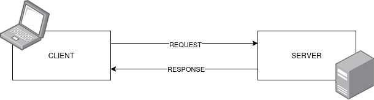
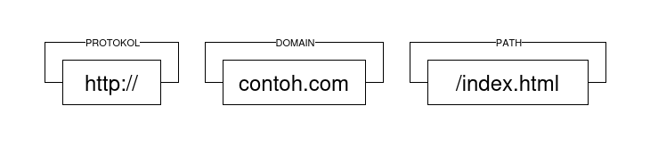
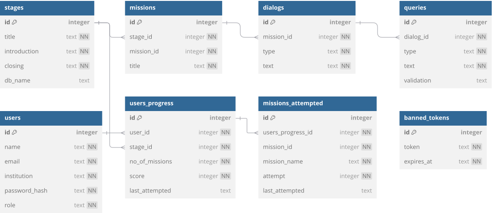

# Panduan Pembuatan Web API untuk SQL Adventure

Ini adalah dokumen panduan pembuatan game edukasi SQL Adventure yang akan membahas segala seluk beluk proses pembuatan dari pengaturan awal hingga proses deployment di internet. Selamat membaca!

## Bagian I: Pendahuluan

Pada bagian ini akan dipaparkan sebuah pengantar teknologi web yang relevan dalam pembuatan game edukasi SQL Adventure. Selain itu pada bagian ini juga akan memaparkan pengaturan awal untuk pembuatan mulai dari pemasangan pustaka, pengaturan direktori dan sebagainya dengan harapan pembaca mampu mengikuti panduan dengan lebih mudah dan lebih memahami hal teknis sebelum memulai proses lebih lanjut pada bagian-bagian berikutnya.

### 1.1. Pengantar Aplikasi Web

Di era modern ini, perkembangan teknologi telah mentransformasi hampir seluruh aspek kehidupan manusia. Berbagai inovasi teknologi memberikan kemudahan dan efisiensi dalam aktivitas sehari-hari, salah satunya melalui kehadiran internet dan platform aplikasi web yang semakin canggih. Kedua teknologi ini tidak hanya mempermudah komunikasi dan pertukaran informasi, tetapi juga mendukung produktivitas, pendidikan, bisnis, serta hiburan, sehingga menjadi bagian tak terpisahkan dari kehidupan masyarakat saat ini. Adapun aplikasi web ialah sebuah sistem yang memungkinkan mengakses dan berbagi informasi melalui jaringan internet. Berbeda dengan aplikasi desktop atau mobile yang harus diunduh dan dipasang di perangkat, aplikasi web berjalan di server remote dan dapat digunakan kapan pun selama terhubung ke internet. Contohnya meliputi berbagai layanan e-commerce (Shopee, Tokopedia), platform media sosial (Facebook, Twitter), atau alat produktivitas (Google Docs, Canva). Teknologi ini tidak berdiri sendiri, tetapi terdiri dari berbagai bagian yang saling bekerja satu sama lain. Untuk dapat memahami lebih lanjut bagaimana aplikasi web bekerja, pertama kita harus memahami terlebih dahulu apa itu internet dan bagaimana cara kerjanya serta kaitannya dengan aplikasi web.

#### 1.1.1. Teknologi Web

Secara garis besar, internet dapat dipahami sebagai sebuah jaringan global yang menghubungkan lebih dari jutaan perangkat seperti komputer, smartphone, tablet dan sebagainya di seluruh dunia, memungkinkan pertukaran data dan komunikasi secara cepat dan efisien. Adapun agar berbagai perangkat tersebut dapat saling berkomunikasi satu sama lain dalam suatu jaringan, terdapat sebuah cara kerja (arsitektur) khusus yang digunakan, disebut sebagai arsitektur client-server. Pada arsitektur ini, perangkat dibagi menjai dua bagian client dan server.

Pada arsitektur ini, server berupa sebuah komputer atau sistem yang menyediakan berbagai sumber daya, data ataupun layanan tertentu. Adapun client dapat berupa sebuah komputer ataupun sistem yang bertugas untuk mengirimkan permintaan (request) kepada server yang selanjutnya akan memberikan balasan (response) sesuai dari permintaan client tersebut. Adapun dalam konteks teknologi web, client biasanya berupa browser seperti Google Chrome ataupun Mozilla Firefox yang digunakan pengguna untuk mengakses halaman web, sementara server adalah komputer yang menyimpan data dari halaman web yang diakses. Adapun ketika client mengirimkan permintaan ke server, selanjutnya server akan memproses permintaan tersebut dan mengirimkan kembali data atau halaman web yang diminta, sehingga model client-server ini memungkinkan browser dan server untuk saling berkomunikasi dalam suatu jaringan.



Seperti yang sudah disebutkan sebelumnya, agar berbagai perangkat dapat berkomunikasi satu sama lain dalam satu jaringan global, diperlukan suatu arsitektur yakni client-server. Pada arsitektur ini diperlukan sebuah protokol, yakni seperangkat aturan dan standar yang mengatur bagaimana data dikirim, diterima, dan diproses dalam suatu jaringan sehingga tidak terjadi kesalahan komunikasi antar perangkat. Adapun protokol yang digunakan dalam teknologi web adalah HTTP (HyperText Transfer Protocol).



Sehinga dengan menggunakan protokol ini, berbagai perangkat yang akan berkomunikasi dalam satu jaringan dapat terstruktur dan sistematis tanpa terjadi kesalahan. Selain itu agar client dapat menghubungi server untuk meminta sumber daya, diperlukan mekanisme pengalamatan. Sebagai contoh kasus ketika pengguna browser membuka laman web yang ingin dikunjunginya, salah satu cara yang dapat dilakukan adalah dengan mengetik alamat dari halaman web tersebut. Seperti misal ketika pengguna ingin mengakses Google, maka akan diketikkan https://google.com pada address bar di bagian atas browser. Adapun alamat tersebut disebut sebagai URL (Uniform Resource Locator), yakni sebuah alamat standar yang digunakan untuk menunjuk lokasi sumber daya di internet. URL terdiri dari beberapa komponen utama, yaitu skema/protokol (http), nama domain, serta path yang menunjukkan lokasi spesifik sumber daya di server tersebut. URL memungkinkan browser untuk mengakses dan mengambil data dari server secara tepat dan terstruktur.

Sebelum memahami lebih lanjut tentang aplikasi web, pertama kita harus mengetahui dulu perbedaan dari situs dan aplikasi web. Secara fundamental, situs dan aplikasi web memiliki perbedaan mendasar dalam tujuan dan fungsionalitas. Situs web pada dasarnya bersifat statis dan informatif, dirancang untuk menampilkan konten seperti artikel, gambar, atau informasi perusahaan yang dapat diakses secara satu arah oleh pengunjung. Contohnya meliputi blog, halaman profil bisnis, atau situs berita yang utamanya berfungsi sebagai sumber referensi tanpa memerlukan interaksi kompleks dari pengguna. Di sisi lain, aplikasi web bersifat dinamis dan interaktif, memungkinkan pengguna tidak hanya mengakses informasi tetapi juga melakukan berbagai operasi seperti input data, pemrosesan transaksi, atau kolaborasi secara real-time. Platform seperti e-commerce, layanan perbankan online, atau aplikasi produktivitas berbasis web merupakan contoh aplikasi web yang memerlukan integrasi dengan database dan logika pemrograman di back-end untuk menjalankan fungsinya. Jadi, perbedaan utama terletak pada tingkat interaktivitas dan kompleksitas teknologi yang digunakan. Sementara situs web cenderung sederhana dengan tampilan konten yang tetap, aplikasi web menawarkan pengalaman pengguna yang lebih dinamis dengan kemampuan untuk memanipulasi dan merespons data secara aktif. Dengan demikian, meskipun keduanya diakses melalui browser, karakteristik dan tujuannya jelas berbeda sesuai kebutuhan penggunanya.

#### 1.1.2. Arsitektur Front-end & Back-end

Aplikasi web modern dibangun dengan arsitektur yang memisahkan antara front-end (client-side) dan back-end (server-side), masing-masing memiliki peran dan teknologi khusus. Front-end merupakan bagian yang berinteraksi langsung dengan pengguna, mencakup antarmuka visual dan logika interaktif yang dibangun menggunakan HTML untuk struktur dasar, CSS untuk tata letak dan desain, serta JavaScript untuk fungsionalitas dinamis. Dengan penggunaan kerangka kerja ataupun berbagai pustaka seperti React, Vue, atau Angular sering digunakan untuk mengembangkan front-end yang lebih terstruktur dan mudah untuk dikembangkan. Sementara itu, back-end berfungsi sebagai otak aplikasi yang menangani pemrosesan data, logika bisnis, penyimpanan database, serta keamanan sistem.

#### 1.1.3. API

Komunikasi antara front-end dan back-end dilakukan melalui API (Application Programming Interface) yang berarsitektur client-server. Adapun API merupakan sekumpulan aturan dan protokol yang memungkinkan berbagai perangkat lunak untuk saling berkomunikasi. Dalam konteks pengembangan aplikasi web, API berperan sebagai jembatan antara front-end dan back-end, atau antara aplikasi dengan layanan pihak ketiga. Melalui API, pengembang dapat mengakses fungsi atau data tertentu tanpa perlu mengetahui detail implementasi di baliknya. Misalnya, sebuah aplikasi web dapat menggunakan API cuaca untuk menampilkan prakiraan terkini tanpa perlu membangun sistem pemrosesan data cuaca secara mandiri. Penggunaan API dalam pengembangan aplikasi web sangat penting karena API memungkinkan pengembangan fitur secara terpisah, yang mempermudah pemeliharaan dan integrasi sistem. Dalam praktiknya, API sering digunakan untuk mengelola autentikasi pengguna, pertukaran data dalam format seperti JSON, dan penghubung ke layanan eksternal seperti pembayaran digital, media sosial, maupun penyimpanan awan (cloud storage). Dengan demikian, API bukan hanya mempercepat proses pengembangan, tetapi juga membuka peluang inovasi melalui integrasi dengan teknologi dan layanan lainnya.

### 1.2. Gambaran Umum

SQL Adventure adalah sebuah game edukasi interaktif yang dirancang untuk membantu pengguna belajar dan memahami bahasa SQL secara bertahap melalui pendekatan berbasis misi. Dalam game ini, setiap pengguna akan mengikuti perjalanan melalui berbagai stage pembelajaran, yang masing-masing berisi sejumlah misi yang menantang. Progres pemain akan dicatat secara otomatis, termasuk skor, jumlah misi yang telah dicoba, dan waktu terakhir mereka berinteraksi dengan sistem. Pemain dapat melihat perkembangan mereka secara real-time, sementara admin memiliki akses khusus untuk mengelola pengguna, memantau aktivitas. Dengan memadukan unsur naratif, gamifikasi, dan latihan praktis, SQL Adventure menawarkan cara belajar SQL yang menyenangkan bagi pelajar dan mahasiswa.

### 1.3. Pengaturan Awal

Pada buku panduan ini akan diajarkan secara umum bagaimana pembuatan game edukasi SQL Adventure dengan menggunakan berbagai teknologi yang tesedia. Game edukasi yang dibuat berupa aplikasi web dengan menggunakan arsitektur front-end & back-end. Pada sisi front-end akan terdapat aplikasi web yang dapat digunakan oleh pengguna untuk berinteraksi seperti memulai game, menjawab berbagai pertanyaan, mengakses leaderboard dan sebagainya. Untuk teknologi yang dipilih pada pengembangan game edukasi ini adalah React sebagai front-end dari game dan Node.js serta berbagai framework tambahan untuk back-end game edukasi.

#### 1.3.1. Sisi Front-end

Untuk pengaturan awal pada sisi front-end pastikan Anda sudah memasang Node.js versi terbaru. Adapun Node.js adalah sebuah runtime JavaScript yang berjalan di sisi server, dibangun di atas mesin V8 milik Google Chrome. Dengan Node.js, pengembang dapat menggunakan JavaScript tidak hanya untuk pengembangan frontend tetapi juga untuk pengembangan backend, memungkinkan pengembangan aplikasi full-stack dengan satu bahasa pemrograman. Node.js dapat dijalankan pada berbagai macam sistem operasi seperti Microsoft Windows, MacOS, berbagai distribusi GNU/Linux, berbagai varian BSD dan sebagainya. Untuk dapat mengeksekusi program, perlu dilakukan instalasi Node.js terlebih dahulu. Terdapat perbedaan dalam instalasi Node.js pada tiap sistem operasi, pada bagian ini akan dipaparkan proses instalasi Node.js pada sistem operasi Windows, MacOS dan GNU/Linux.

Terdapat beberapa cara yang dapat dilakukan untuk melakukan instalasi Node.js pada sistem operasi Windows dan MacOS. Adapun pada tutorial ini dipaparkan cara termudah yang dapat dilakukan, yakni dengan menggunakan installer resmi yang telah disediakan pada situs resmi Node.js (https://nodejs.org). Berikut adalah langkah-langkah yang dapat dilakukan untuk instalasi Node.js:

1. Pergi ke situs https://nodejs.org melalui browser.
2. Pada halaman utama akan muncul tombol besar dengan judul “Download Node.js (LTS)” dan klik tombol tersebut untuk mulai mengunduh installer resmi.
3. Setelah selesai mengunduh installer (perhatikan ekstensi berkas .msi untuk Windows dan .dmg untuk MacOS), klik dan jalankan untuk memulai proses instalasi.
4. Seperti layaknya melakukan instalasi program, tekan tombol “Next” hingga proses selesai dan centang “ADD PATH” saat proses instalasi.
5. Setelah proses instalasi selesai dan pengaturan “ADD PATH” dicentang ketika proses instalasi, maka Node.js dapat dijalankan pada Command Prompt. Untuk melakukan pengecekan apakah Node.js berhasil dipasang, buka Command Prompt dan ketikan perintah berikut: `node -v` dan jika muncul versi dari Node.js, maka proses instalasi berhasil.

Adapun untuk GNU/Linux, dengan begitu banyaknya jenis distribusi dengan sistem package manager yang berbeda-beda, tentunya tidak dapat dijelaskan satu per satu dalam pemaparan ini, tetapi pada prinsip dasarnya sama. Pada pemaparan ini akan disampaikan untuk distribusi GNU/Linux yang paling banyak digunakan, yakni Debian beserta turunannya yang masih menggunakan package manager yang sama (apt). Adapun berikut adalah langkah-langkah yang dapat dilakukan untuk instalasi Node.js pada sistem operasi Debian dan turunannya.

1. Pada Debian, Node.js tersedia pada repositori bawaan dengan nama “nodejs”.
2. Buka terminal dan lakukan pembaharuan terlebih dahulu dengan perintah `$ sudo apt update`, jika terdapat pembaharuan, teruskan prosesnya terlebih dahulu sebelum lanjut melakukan instalasi.
3. Setelah selesai memperbaharui sistem, selanjutnya melakukan instalasi Node.js dengan menjalankan perintah berikut `$ sudo apt nodejs npm`.
4. Setelah perintah di atas selesai dijalankan, cobalah periksa apakah Node.js sudah terpasang dengan baik dengan perintah berikut `$ node -v`, jika muncul versi dari Node.js, maka proses instalasi berhasil.

Jika proses pemasangan Node.js telah selesai selanjutnya akan dimulai pemasangan pustaka React dan berbagai pustaka tambahan lainnya untuk memulai proses pembuatan game edukasi. Adapun berikut adalah langkah-langkah pemasangan berbagai pustaka yang diperlukan untuk pengembangan sisi front-end dari game edukasi:

1. Buka Command Prompt ataupun Terminal dan arahkan pada folder di mana biasa Anda membuat proyek. Kemudian jalankan perintah berikut untuk memulai inisiasi proyek Vite, sebuah tool untuk mempermudah pengembangan aplikasi web dengan React `$ npm create vite@latest -- --template react`.
2. Setelah perintah di atas dijalankan, Anda diminta untuk memasukan nama proyek, masukan “sql-adventure” dan kemudian tekan enter.
3. Setelah selesai maka akan muncul arahan untuk masuk ke folder yang namanya sesuai dengan nama proyek yang Anda masukan. Setelah masuk ke dalam folder tersebut (dengan perintah cd), lanjut jalankan perintah berikut untuk melakukan pemasangan berbagai pustaka yang diperlukan oleh Vite untuk memulai pengembangan game edukasi `$ npm install`.
4. Setelah selesai kemudian Anda harus memeriksa apakah semua sudah siap dan berjalan sebagaimana mestinya yakni dengan menjalankan perintah npm run dev untuk menjalankan aplikasi pada mode development. Jika semua sesuai, maka akan muncul perintah untuk membuka URL http://localhost:5173 untuk dapat mulai mengakses aplikasi.
5. Selanjutnya diperlukan berbagai tambahan pustaka lainnya, adapun pustaka tersebut adalah sebagai berikut:
   - jwt-decode: untuk melakukan autentikasi pengguna dari back-end.
   - react-bootstrap: tambahan untuk mengikat bootstrap dan React.
   - react-icons: untuk kebutuhan berbagai icon pada aplikasi.
   - react-joyride: untuk menampilkan intro pengunaan aplikasi.
   - remark-gfm: untuk mengubah materi pembelajaran yang ditulis dengan Markdown menjadi halaman di aplikasi web.
   - react-router-dom: untuk mengatur routing aplikasi.
   - react-markdown: pustaka untuk mengikat dan menampilkan materi pembelelarajan yang ditulis dengan markdown pada aplikasi web.
   - sql.js: untuk melakukan eksekusi kode SQL pada sisi client.
   - bootstrap: framework CSS untuk mengatur tampilan (dev).
   - sass: untuk melakukan kustomisasi bootstrap (dev).
   - vite-plugin-wasm: untuk mengikat vite dengan wasm agar sql.js bisa dijalankan (dev).
6. Untuk memasang berbagai pustaka di atas, jalankan dua perintah berikut secara berurutan `$ npm install jwt-decode react-bootstrap react-icons react-joyride remark-gfm react-router-dom react-markdown sql.js` dan `$ npm install -D bootstrap sass vite-plugin-wasm`.
7. Setelah perintah di atas selesai dijalankan, sisi front-end siap untuk dikembangkan lebih lanjut.

#### 1.3.2. Sisi Back-end

Pada sisi back-end, berupa sebuah Web API yang dibangun menggunakan teknologi Node.js dan berbagai tambahan pustaka lainnya. Adapun berikut langkah-langkah untuk melakukan pengaturan awal:

1. Buka Command Prompt ataupun Terminal dan arahkan pada folder di mana biasa Anda membuat proyek. Kemudian jalankan perintah berikut untuk memulai inisiasi proyek `$ mkdir sql-adventure-api && cd sql-adventure-api && npm init -y` dan setelah berhasil, akan muncul berkas dengan nama package.json.
2. Beberapa pustaka tambahan dibutuhkan untuk pengembangan back-end. Adapun berikut adalah daftar pustaka yang dibutuhkan:
   - bcryptjs: implementasi enkripsi bcrypt untuk Node.js.
   - better-sqlite3: untuk melakukan koneksi API dengan database SQLite.
   - dotenv: untuk memuat environment variables ke dalam API.
   - express: framework mini untuk pengembangan Web API.
   - helmet: untuk mengamankan response dari server pada level header.
   - jsonwebtoken: untuk mengamankan API.
   - morgan: digunakan untuk melakukan logging secara terstruktur.
   - cors: agar API bisa mengakses resource pada domain lain.
3. Untuk dapat memasang berbagai pustaka di atas tadi, jalankan perintah berikut `$ npm install bcryptjs better-sqlite3 cors dotenv express helmet jsonwebtoken morgan`.
4. Selanjutnya buat folder src dengan perintah `mkdir src` dan masuk ke dalam folder dengan perintah `cd src` dan buat beberapa folder tambahan:
   - data: untuk menyimpan berbagai kebutuhan database.
   - handlers: digunakan untuk melakukan proses request dari client dan mengembalikannya dalam bentuk json.
   - helpers: digunakan untuk menyimpan berbagai fungsi untuk membantu memproses request dari client.
   - middlewares: digunakan untuk memproses request sebelum masuk ke handler, biasanya untuk autentikasi, logging ataupun error handling dan sebagainya.
   - models: digunakan untuk menyimpan fungsi untuk memodelkan data pada database.
   - routes: digunakan untuk mendefinisikan route resource aplikasi.
5. Setelah selesai, maka sisi back-end siap untuk dikembangkan lebih lanjut.

## Bagian II: Pengembangan Back-end

Pada bagian ini akan dipaparkan berbagai hal terkait pengembangan back-end untuk game edukasi SQL Adventure mulai dari data yang diperlukan, model, setup server, handler, routing dan middleware.

### 2.1. Entity

Seperti yang sudah disebutkan sebelumnya di bagian pertama, back-end pada pengembangan game edukasi ini berupa sebuah Web API yang bertugas untuk menerima, memproses dan menyimpan berbagai data yang diperlukan oleh front-end seperti data pengguna, data soal, data skor dan sebagainya. Setelah back-end berhasil diinisiasi pada bagian sebelumnya, berikut akan didefinisikan entitas (data) apa saja yang dibutuhkan oleh game edukasi. Adapun untuk overview dari berbagai data yang akan digunakan pada API yang disajikan dalam diagram ERD seperti beirkut.



Sebelum kita memaparkan semua entity yang akan digunakan, pertama harus dipahami terlebih dahulu bagaimana alur data mengalir pada game edukasi ini. Dengan tujuan utama "kemudahan", data terkait segala hal yang ada di dalam permainan seperti tahapan, misi, kueri yang harus dibuat disimpan di dalam sisi front-end, sehingga kita akan mempelajari terlebih dahulu bentuk (shape) dari data ini untuk dapat memahami data lain yang akan disediakan pada sisi back-end.

#### 2.1.1. Stories

Entity ini digunakan untuk merepresentasikan cerita yang akan digunakan sebagai dialog sistem kepada pengguna yang berisikan perintah, informasi dan sebagainya. Adapun data ini disimpan dalam format JSON dengan bentuk berikut.

```json
{
  "id": <id topik>,
  "introduction": <teks pendahuluan>,
  "missions": [
    {
      "id": <id misi>,
      "title": <judul misi>,
      "dialogs": [
        {
          "type": <tipe dari dialog [narration | instruction]>,
          "text": <teks dialog>,
          "sql": {
            "type": <tipe dari kueri [exec | run]>,
            "query": <jawaban kueri dialog>,
            "validation": <kueri validasi (optional hanya jika type=run)>
          }
        }
      ]
    }
  ],
  "closing": <teks penutup>,
  "filepath": <path dari berkas database>
}
```

Tiap tahapan (stage) pada game edukasi berisikan berbagai misi. Tiap misi memiliki dialognya tersendiri. Tiap dialog memiliki tipe apakah hanya narasi atau perintah untuk menuliskan kueri. Tiap kueri yang dituliskan memiliki tipe apakah hanya dijalankan saja atau perlu divalidasi. Adapun data dari API berikut akan menyesuaikan format di atas dan seterusnya.

#### 2.1.2. Users

Entity ini digunakan untuk merepresentasikan pengguna di dalam game edukasi.

User memiliki properti berikut:

- id: Identifier (pembeda) untuk tiap pengguna.
- name: Nama lengkap dari pengguna.
- institution: Nama institusi asal pengguna (contoh: Universitas Lambung Mangkurat).
- password: Kata sandi dari pengguna yang telah dilakukan proses hashing.
- role: Penanda peran (role) dari pengguna (hanya terdiri dari admin atau user saja).

Adapun kode SQL berikut digunakan untuk membuat tabel dengan nama `users` sesuai dengan properti di atas.

```sql
CREATE TABLE IF NOT EXISTS users (
    id INTEGER PRIMARY KEY AUTOINCREMENT,
    name TEXT NOT NULL,
    email TEXT NOT NULL UNIQUE,
    institution TEXT NOT NULL,
    password_hash TEXT NOT NULL,
    role TEXT NOT NULL CHECK (role IN ('admin', 'user'))
);
```

#### 2.1.3. Stages

Pada game edukasi terdapat tahapan (stages) yang bertujuan untuk mengasah kemampuan pengguna lebih dalam dengan tiap tingkat tahapan. Entity stages digunakan sebagai representasi tahapan yang terdapat pada game edukasi.

Tahapan (stage) memiliki properti berikut:

- id: Identifier (pembeda) untuk tiap tahapan.
- title: Judul dari tahapan.
- introduction: Teks pendahuluan tahapan.
- closing: Teks penutup tahapan.
- db_name: Nama database yang digunakan dalam tahapan.

Adapun kode SQL berikut digunakan untuk membuat tabel dengan nama `stages` sesuai dengan properti di atas.

```sql
CREATE TABLE IF NOT EXISTS stages (
    id INTEGER PRIMARY KEY,
    title TEXT NOT NULL,
    introduction TEXT NOT NULL,
    closing TEXT NOT NULL,
    db_name TEXT
);
```

#### 2.1.4. Missions

Pada tiap tahapan dalam game edukasi terdapat misi (mission). Entity missions digunakan sebagai representasi misi yang terdapat pada game edukasi.

Misi (mission) memiliki properti berikut:

- id: Identifier (pembeda) untuk tiap misi.
- stage_id: Menyimpan id dari tahapan (stage).
- mission_id: Menyimpan id dari misi.
- title: Judul dari misi.

Adapun kode SQL berikut digunakan untuk membuat tabel dengan nama `missions` sesuai dengan properti di atas.

```sql
CREATE TABLE IF NOT EXISTS missions (
    id INTEGER PRIMARY KEY,
    stage_id INTEGER NOT NULL,
    mission_id INTEGER NOT NULL,
    title TEXT NOT NULL,
    FOREIGN KEY (stage_id) REFERENCES stages(id) ON DELETE CASCADE
);
```

> Catatan: Entity ini berkaitan dengan entity stages sehingga jika tabel entity stages dihapus maka tabel entity ini juga akan dihapus.

#### 2.1.5. Dialogs

Pada tiap misi dalam game edukasi terdapat dialog. Entity dialogs digunakan sebagai representasi dialog yang terdapat pada game edukasi.

Dialog memiliki properti berikut:

- id: Identifier (pembeda) untuk tiap dialog.
- mission_id: Identifier (pembeda) untuk tiap misi.
- type: Tipe dari dialog dapat berupa narasi atau instruksi.
- text: Teks dialog.

Adapun kode SQL berikut digunakan untuk membuat tabel dengan nama `dialogs` sesuai dengan properti di atas.

```sql
CREATE TABLE IF NOT EXISTS dialogs (
    id INTEGER PRIMARY KEY AUTOINCREMENT,
    mission_id INTEGER NOT NULL,
    type TEXT NOT NULL CHECK (type IN ('narration', 'instruction')),
    text TEXT NOT NULL,
    FOREIGN KEY (mission_id) REFERENCES missions(id) ON DELETE CASCADE
);
```

> Catatan: Entity ini berkaitan dengan entity stages sehingga jika tabel entity stages dihapus maka tabel entity ini juga akan dihapus.

#### 2.1.6. Queries

Pada tiap dialog dalam game edukasi terdapat query. Entity queries digunakan sebagai representasi query yang terdapat pada game edukasi.

Query memiliki properti berikut:

- id: Identifier (pembeda) untuk tiap query.
- dialog_id: Identifier (pembeda) untuk tiap dialog.
- type: Tipe dari query dapat berupa exec atau run.
- text: Query dari dialog.
- validation: Query validasi.

Adapun kode SQL berikut digunakan untuk membuat tabel dengan nama `queries` sesuai dengan properti di atas.

```sql
CREATE TABLE IF NOT EXISTS queries (
    id INTEGER PRIMARY KEY AUTOINCREMENT,
    dialog_id INTEGER NOT NULL,
    type TEXT NOT NULL CHECK (type IN ('exec', 'run')),
    text TEXT NOT NULL,
    validation TEXT,
    FOREIGN KEY (dialog_id) REFERENCES dialogs(id) ON DELETE CASCADE
)
```

> Catatan: Entity ini berkaitan dengan entity stages sehingga jika tabel entity stages dihapus maka tabel entity ini juga akan dihapus.

#### 2.1.7. User Progress

Progres dari pengguna harus terus dicatat untuk dapat menganalisis bagaimana pengalaman pengguna dan untuk admin agar dapat melihatnya. Entity user progress digunakan untuk merepresentasikan hal ini. Tiap progress disimpan untuk tiap tahapan.

User progress memiliki properti berikut:

- id: Identifier (pembeda) untuk tiap progres dari pengguna yang berbeda.
- user_id: Identifier (pembeda) untuk tiap pengguna.
- stage_id: Identifier (pembeda) untuk tiap tahapan.
- no_of_missions: Jumlah banyaknya misi.
- score: Skor yang didapatkan oleh pengguna.
- last_attempted: Timestamp terakhir kali pengguna mengakses tahapan.

Adapun kode SQL berikut digunakan untuk membuat tabel dengan nama `users_progress` sesuai dengan properti di atas.

```sql
CREATE TABLE IF NOT EXISTS users_progress (
  id INTEGER PRIMARY KEY AUTOINCREMENT,
  user_id INTEGER NOT NULL,
  stage_id INTEGER NOT NULL,
  no_of_missions INTEGER NOT NULL,
  score INTEGER NOT NULL,
  last_attempted TEXT,
  FOREIGN KEY (user_id) REFERENCES users(id) ON DELETE CASCADE
);
```

> Catatan: Entity ini berkaitan dengan entity users sehingga jika tabel entity users dihapus maka tabel entity ini juga akan dihapus.

#### 2.1.8. Missions Attempted

Tiap misi yang dikerjakan pada tiap tahapan perlu juga dicatat karena keperluan di halaman admin untuk mengetahui berapa kali pengguna mencoba misi tersebut dan kapan terakhir mengakses misi tersebut. Entity missions attempted digunakan untuk merepresentasikan hal ini.

Missions attempted memiliki properti berikut:

- id: Identifier (pembeda) untuk tiap progres dari pengguna yang berbeda.
- users_progress_id: Identifier (pembeda) untuk tiap user progress.
- mission_id: Identifier (pembeda) untuk tiap misi.
- mission_name: Judul misi.
- attempt: Penghitung berapa kali pengguna mencoba misi.
- last_attempted: Timestamp terakhir kali pengguna mengakses misi.

Adapun kode SQL berikut digunakan untuk membuat tabel dengan nama `missions_attempted` sesuai dengan properti di atas.

```sql
CREATE TABLE IF NOT EXISTS missions_attempted (
  id INTEGER PRIMARY KEY AUTOINCREMENT,
  users_progress_id INTEGER NOT NULL,
  mission_id INTEGER NO NULL,
  mission_name TEXT NO NULL,
  attempt INTEGER NOT NULL DEFAULT 0,
  last_attempted TEXT,
  FOREIGN KEY (users_progress_id) REFERENCES users_progress(id) ON DELETE CASCADE
);
```

> Catatan: Entity ini berkaitan dengan entity users_progress sehingga jika tabel entity users_progress dihapus maka tabel entity ini juga akan dihapus.

#### 2.1.9. Banned Tokens

Pada Web API ini diterapkan sistem keamanan (authentication dan authorization) dengan menggunakan JSON Web Token (JWT). Pengguna yang telah register akan diberikan token pada saat melakukan login yang mana dapat digunakan untuk mengakses resource lain untuk keperluan game edukasi. Token ini berbatas waktu (1 hari) sehingga jika pengguna melakukan logout sebelum masa token habis, token yang digunakan sebelumnya akan dibanned agar tidak dapat digunakan kembali. Namun token yang telah dibanned akan dihapus secara berkala agar tidak membebani sistem. Untuk penjelasan lebih lanjut akan dipaparkan pada bagian Autentikasi dan Autorisasi.

Adapun kode SQL berikut digunakan untuk membuat tabel dengan nama `banned_tokens` sesuai dengan keperluan di atas.

```sql
-- create banned_tokens table
CREATE TABLE IF NOT EXISTS banned_tokens (
  id INTEGER PRIMARY KEY AUTOINCREMENT,
  token TEXT NOT NULL,
  expires_at TEXT NOT NULL
);
```

### 2.2. SQLite, Migrations dan Mocking Data

Untuk dapat menyimpan data yang telah diproses ataupun yang akan dikirim oleh API kepada klien, diperlukan suatu sistem penyimpanan database. Pada pengembangan game edukasi ini dipilih SQLite sebagai database yang digunakan dengan tentunya terdapat keunggulan dan juga kekurangannya. Selain itu untuk mempermudah dalam proses pengembangan game, diterapkan teknik Migrations. Migrations adalah mekanisme terstruktur dalam pengembangan perangkat lunak, khususnya pada sistem database, yang digunakan untuk mengelola perubahan skema database secara terkendali. Dengan migrations, pengembang dapat mendefinisikan berbagai perubahan seperti pembuatan tabel, penambahan kolom, atau modifikasi relasi dalam bentuk skrip yang dapat dijalankan berurutan sesuai urutan versi. Hal ini memastikan konsistensi skema database serta mempermudah rollback jika terjadi kesalahan. Salah satu migration yang dibuat adalah untuk melakukan mocking data. Mocking adalah data buatan yang dirancang untuk meniru struktur dan karakteristik data asli, namun tidak berasal dari sumber nyata. Data ini digunakan dalam pengembangan, pengujian, atau demonstrasi sistem perangkat lunak ketika data sebenarnya belum tersedia atau tidak boleh digunakan karena alasan privasi dan keamanan. Mock data memungkinkan pengembang menguji fungsionalitas, antarmuka, dan logika aplikasi secara aman dan efisien tanpa risiko terhadap informasi sensitif. Biasanya data ini disiapkan secara manual atau dihasilkan otomatis agar tetap valid secara teknis, meskipun tidak bermakna secara semantik.

#### 2.2.1. Mocking

Daftar mocking yang tersedia pada API adalah sebagai berikut:

- mock_stages_table_up => untuk membuat data mock pada tabel yang berkaitan dengan stage, misi, kueri, dan sebagainya.
- mock_stages_table_down => untuk menghapus data mock pada tabel yang berkaitan dengan stage, misi, kueri, dan sebagainya.
- mock_users_table_up => untuk membuat data mock pada tabel yang berkaitan dengan pengguna, progres, serta misi yang telah diselesaikan.
- mock_users_table_down => untuk menghapus data mock pada tabel yang berkaitan dengan pengguna, progres, serta misi yang telah diselesaikan.

#### 2.2.2. Migrasi

Daftar migration yang tersedia pada API adalah sebagai berikut:

- create_stages_table_up => untuk membuat tabel yang berkaitan dengan stage, misi, kueri, dan sebagainya.
- create_stages_table_down => untuk menghapus yang berkaitan dengan stage, misi, kueri, dan sebagainya.
- create_users_table_up => untuk membuat tabel yang berkaitan dengan pengguna, progres, serta misi yang telah diselesaikan.
- create_users_table_down => untuk menghapus tabel yang berkaitan dengan pengguna, progres, serta misi yang telah diselesaikan.

#### 2.2.3. Setup Koneksi

Pustaka yang digunakan pada API ini adalah better-sqlite3 untuk dapat menghubungkan aplikasi dengan database SQLite. Untuk memudahkan pembedaan pada tahap pengembangan (development) dan publikasi (production), digunakan setup yang berbeda untuk database sehingga tidak mencampur adukkan data test dengan data asli untuk publikasi API di internet. Adapun kode untuk menghubungkan aplikasi dengan databse adalah sebagai berikut.

```js
// ./src/constants.ts
export const constants = {
  ENV_LOCAL: ".env.local",
  ENV_PROD: ".env.prod",
  DB_NAMES: ["local.db", "prod.db"],
  DB_PATH_LOCAL: "./src/data/bin",
  DB_PATH_PROD: "./dist/data/bin",
  // ...
};
```

Kode di atas digunakan untuk menyimpan konstanta nama database untuk level development dan production serta path dari database.

```js
// ./src/config.ts
import dotenv from "dotenv";

import { constants } from "@/constants";

const { DB_PATH_LOCAL, DB_PATH_PROD, ENV_LOCAL, ENV_PROD } = constants;
const NODE_ENV = process.env.NODE_ENV || "development";

let DB_PATH: string;
if (NODE_ENV !== "production") {
  dotenv.config({
    path: ENV_LOCAL,
  });
  DB_PATH = DB_PATH_LOCAL;
} else {
  dotenv.config({
    path: ENV_PROD,
  });
  DB_PATH = DB_PATH_PROD;
}

export const config = {
  DB_PATH: `${DB_PATH}/${process.env.DB_NAME}`,
  // ...
};
```

Kode di atas digunakan untuk menyimpan konfigurasi aplikasi yang salah satunya digunakan dalam koneksi ke database.

```js
import * as fs from "fs";
import * as path from "path";
import Database from "better-sqlite3";

import { constants } from "@/constants";
import { config } from "@/config";
import { deleteAllBannedTokens } from "@/models/tokens";

const { DB_PATH } = config;

// tutup program jika nama database tidak sesuai
const { DB_NAMES } = constants;
if (!DB_NAMES.some((name) => DB_PATH.includes(name))) {
  console.error(
    "=> db: incorrect DB_NAME value. Did you put the correct .env?"
  );
  process.exit(1);
}

// membuat direktori "src/data/bin" jika belum ada
const dirname = path.dirname(DB_PATH);
if (!fs.existsSync(dirname)) {
  fs.mkdirSync(dirname, { recursive: true });
}

export const db = new Database(DB_PATH);
db.pragma("journal_mode = WAL");

// melakukan migrasi database
try {
  const files = ["create_users_table_up.sql", "create_stages_table_up.sql"];
  if (process.env.NODE_ENV !== "production") {
    files.push("mock_users_table_up.sql");
  }

  files.forEach((file) => {
    const query = fs.readFileSync(path.join(__dirname, "migrations", file), {
      encoding: "utf-8",
    });
    db.exec(query);
  });

  console.log("=> db: migration applied successfully");
} catch (err) {
  console.error(err);
  process.exit(1);
}

// menghapus semua token yang terbanned setiap jam
const interval = setInterval(() => {
  const [error] = deleteAllBannedTokens();
  if (error) {
    console.error(error);
    process.exit(1);
  }

  console.log("=> db: all expired banned_tokens is cleaned");
}, 60 * 60 * 1000);

// tutup database jika program dihentikan dengan signal SIGINT (CTRL + C)
process.on("SIGINT", () => {
  clearInterval(interval);

  db.close();
  process.exit(0);
});
```

Secara singkat adapun alur pengaturan koneksi database di atas adalah sebagai berikut.

1. Program akan memuat environment variables yang telah diset dan dimuat untuk mengatur koneksi database.
2. Jika program menerima nama database yang tidak sesuai format, program akan berhenti.
3. Selanjutnya program akan membuat direktori untuk menyimpan database jika belum ada.
4. Program akan melakukan migrasi database.
5. Program akan melakukan mocking database jika tidak dalam production.
6. Selanjutnya program melakukan penjadwalan penghapusan token yang telah terbanned.
7. Program akan melakukan listening jika terdapat perintah untuk menutup program dengan sinyal SIGNIT dari sitem operasi dan menutup datbase dan menghapus penjadwalan penghapusan token yang telah terbanned.

### 2.3. Model

Dalam konteks pengembangan aplikasi, model merujuk pada komponen yang bertanggung jawab untuk merepresentasikan, mengelola, dan memanipulasi data serta logika bisnis aplikasi. Model berperan sebagai jembatan antara lapisan penyimpanan data (seperti basis data) dan logika aplikasi yang berhubungan langsung dengan pengguna. Model menangani segala hal yang berkaitan dengan struktur data, validasi, relasi antar entitas, serta operasi seperti penyimpanan, pembaruan, penghapusan, dan pengambilan data. Dalam praktiknya, model sering kali diimplementasikan sebagai kelas atau objek yang merepresentasikan entitas tertentu, misalnya User, Product, atau Article, yang masing-masing mencerminkan tabel dalam basis data. Dengan memisahkan logika data ke dalam model, aplikasi menjadi lebih terorganisir.

#### 2.3.1. Users

Model user digunakan untuk merepresentasikan tabel user pada database ke sistem. Adapun beberapa fungsionalitas dari model ini adalah sebagai berikut.

##### addOneUser

Menambah satu pengguna baru

```ts
function addOneUser(
  name: string,
  email: string,
  institution: string,
  password: string,
  role: string = "user"
): [User?, Error?] {
  try {
    const password_hash = bcrypt.hashSync(password, 12);
    const result = db
      .prepare(
        `
      INSERT INTO users (name, email, institution, password_hash, role) VALUES (?, ?, ?, ?, ?);
    `.trim()
      )
      .run(name, email, institution, password_hash, role);

    if (result.changes === 0) {
      return [undefined, undefined];
    }

    const id = result.lastInsertRowid as number;
    const [user, error] = getOneUser(id);
    if (error) {
      return [undefined, undefined];
    }

    return [user, undefined];
  } catch (err) {
    const error = err as Error;
    return [undefined, error];
  }
}
```

Adapun alur kode di atas adalah sebagai berikut.

1. Fungsi menerima data input pengguna dari nama, email, institusi dan password.
2. Input password pengguna harus dilakukan hashing dengan menggunakan `bcrypt` dengan salt 12 agar password aman saat disimpan pada database.
3. Memasukan data input pengguna dengan menggunakan kueri SQL standar.
4. Jika terjadi error, akan direturn dan diproses pada fungsi berikutnya.

##### deleteOneUser

Menghapus satu pengguna berdasarkan id

```ts
function deleteOneUser(id: number): [boolean, Error?] {
  try {
    const result = db
      .prepare("DELETE FROM users WHERE id = ? AND role = 'user'")
      .run(id);

    if (result.changes === 0) {
      return [false, undefined];
    }

    return [true, undefined];
  } catch (err) {
    const error = err as Error;
    return [false, error];
  }
}
```

Adapun alur kode di atas adalah sebagai berikut.

1. Fungsi menerima id dari pengguna yang akan dihapus.
2. Menghapus pengguna pada database dengan kueri SQL standar.
3. Jika terjadi error, akan direturn dan diproses pada fungsi berikutnya.

##### getAllUsers

Mendapatkan semua data pengguna

```ts
function getAllUsers(): [User[], Error?] {
  try {
    const results = db
      .prepare("SELECT * FROM users WHERE role = 'user'")
      .all() as UserRow[];

    const users: User[] = results.map((result) => ({
      id: result.id,
      name: result.name,
      email: result.email,
      institution: result.institution,
      passwordHash: result.password_hash,
      role: result.role,
    }));

    return [users, undefined];
  } catch (err) {
    const error = err as Error;
    return [[], error];
  }
}
```

Adapun alur kode di atas adalah sebagai berikut.

1. Fungsi menjalankan kueri SQL standar untuk mengambil data semua pengguna.
2. Jika terjadi error, akan direturn dan diproses pada fungsi berikutnya.

##### getOneUser

Mendapatkan satu pengguna berdasarkan id

```ts
function getOneUser(id: number): [User?, Error?] {
  try {
    const result = db
      .prepare("SELECT * FROM users WHERE id = ? AND role = 'user'")
      .get(id) as UserRow | undefined;

    if (!result) {
      return [undefined, undefined];
    }

    const user: User = {
      id: result.id,
      name: result.name,
      email: result.email,
      institution: result.institution,
      passwordHash: result.password_hash,
      role: result.role,
    };

    return [user, undefined];
  } catch (err) {
    const error = err as Error;
    return [undefined, error];
  }
}
```

Adapun alur kode di atas adalah sebagai berikut.

1. Fungsi menerima id dari pengguna yang akan dicari.
2. Fungsi menjalankan kueri SQL standar untuk mengambil data pengguna berdasarkan id.
3. Jika terjadi error, akan direturn dan diproses pada fungsi berikutnya.

##### getOneUserByEmail

Mendapatkan satu pengguna berdasarkan email

```ts
function getOneUserByEmail(email: string): [User?, Error?] {
  try {
    const result = db
      .prepare("SELECT * FROM users WHERE email = ?")
      .get(email) as UserRow | undefined;

    if (!result) {
      return [undefined, undefined];
    }

    const user: User = {
      id: result.id,
      name: result.name,
      email: result.email,
      institution: result.institution,
      passwordHash: result.password_hash,
      role: result.role,
    };

    return [user, undefined];
  } catch (err) {
    const error = err as Error;
    return [undefined, error];
  }
}
```

Adapun alur kode di atas adalah sebagai berikut.

1. Fungsi menerima email dari pengguna yang akan dicari.
2. Fungsi menjalankan kueri SQL standar untuk mengambil data pengguna berdasarkan email.
3. Jika terjadi error, akan direturn dan diproses pada fungsi berikutnya.

#### 2.4.2. User Progress

##### addOneUserProgress

Menambahkan progress user

```ts
function addOneUserProgress(
  userId: number,
  stageId: number,
  noOfMissions: number
): [boolean, Error?] {
  try {
    const stmt = db.prepare(
      `
      INSERT INTO users_progress (user_id, stage_id, no_of_missions, score, last_attempted)
      VALUES (?, ?, ?, 0, null);
    `.trim()
    );
    const result = stmt.run(userId, stageId, noOfMissions);
    if (result.changes === 0) {
      return [false, undefined];
    }

    return [true, undefined];
  } catch (err) {
    const error = err as Error;
    return [false, error];
  }
}
```

Adapun alur kode di atas adalah sebagai berikut.

1. Fungsi menerima input id dari pengguna, id dari tahapan dan jumlah misi.
2. Mengisi progress baru pengguna dengan menggunakan kueri SQL standar.
3. Jika terjadi error, akan direturn dan diproses pada fungsi berikutnya.

##### deleteOneUserProgress

Menghapus progress user

```ts
function deleteOneUserProgress(userId: number): [boolean, Error?] {
  try {
    const stmt = db.prepare("DELETE FROM users_progress WHERE user_id = ?");
    const result = stmt.run(userId);
    if (result.changes === 0) {
      return [false, undefined];
    }

    return [true, undefined];
  } catch (err) {
    const error = err as Error;
    return [false, error];
  }
}
```

Adapun alur kode di atas adalah sebagai berikut.

1. Fungsi menerima input id dari pengguna.
2. Menghapus progress use dengan menggunakan kueri SQL standar.
3. Jika terjadi error, akan direturn dan diproses pada fungsi berikutnya.

##### getAllUserProgressJSON

Mendapatkan user progress dalam bentuk JSON sesuai dengan kontrak API.

```ts
function getAllUsersProgressJSON(): [UserProgressJSON[], Error?] {
  try {
    const result = db
      .prepare(
        `
SELECT
  u.id as user_id,
  u.email as user_email,
  u.name as user_name,
  u.institution as user_institution,
  up.id as users_progress_id,
  up.stage_id as users_progress_stage_id,
  up.no_of_missions as users_progress_no_of_missions,
  up.score as users_progress_score,
  up.last_attempted as users_progress_last_attempted,
  ma.id as missions_attempted_id,
  ma.mission_id as missions_attempted_mission_id,
  ma.mission_name as missions_attempted_mission_name,
  ma.attempt as missions_attempted_attempt,
  ma.last_attempted as missions_attempted_last_attempted
FROM users u
LEFT JOIN users_progress up ON u.id = up.user_id
LEFT JOIN missions_attempted ma ON up.id = ma.users_progress_id
WHERE u.role = 'user'
ORDER BY u.id, up.id, ma.id;
`.trim()
      )
      .all() as UserProgressJSONRow[];
    const usersProgress = getUsersProgressJSON(result);

    return [usersProgress, undefined];
  } catch (err) {
    const error = err as Error;
    return [[], error];
  }
}
```

Adapun berikut adalah kode untuk fungsi bantu getUsersProgressJSON.

```ts
function formatDateToTimestamp(date: Date) {
  const year = date.getFullYear();
  const month = String(date.getMonth() + 1).padStart(2, "0");
  const day = String(date.getDate()).padStart(2, "0");
  const hours = String(date.getHours()).padStart(2, "0");
  const minutes = String(date.getMinutes()).padStart(2, "0");
  const seconds = String(date.getSeconds()).padStart(2, "0");

  return `${year}-${month}-${day} ${hours}:${minutes}:${seconds}`;
}

function getUsersProgressJSON(rows: UserProgressJSONRow[]) {
  const json: UserProgressJSON[] = [];

  rows.forEach((row) => {
    let user = json.find((u) => u.user_id === row.user_id);

    if (!user) {
      user = {
        user_id: row.user_id,
        user_email: row.user_email,
        user_name: row.user_name,
        user_institution: row.user_institution,
        values: [],
      };
      json.push(user);
    }

    if (!row.users_progress_id) return;
    let progress = user.values.find(
      (v) => v.stage_id === row.users_progress_stage_id
    );
    if (!progress) {
      progress = {
        stage_id: row.users_progress_stage_id,
        no_of_missions: row.users_progress_no_of_missions,
        score: row.users_progress_score,
        last_attempted: row.users_progress_last_attempted
          ? formatDateToTimestamp(new Date(row.users_progress_last_attempted))
          : null,
        missions_attempted: [],
      };
      user.values.push(progress);
    }

    if (!row.missions_attempted_id) return;
    let mission = progress.missions_attempted.find(
      (m) => m.mission_id === row.missions_attempted_mission_id
    );
    if (!mission) {
      mission = {
        mission_id: row.missions_attempted_mission_id,
        mission_name: row.missions_attempted_mission_name,
        attempt: row.missions_attempted_attempt,
        last_attempted: formatDateToTimestamp(
          new Date(row.missions_attempted_last_attempted)
        ),
      };
      progress.missions_attempted.push(mission);
    }
  });

  return json;
}
```

Adapun alur kode di atas adalah sebagai berikut.

1. Fungsi menjalankan kueri SQL seperti di atas untuk menerima semua progress dari pengguna.
2. Fungsi memanggil fungsi bantuan `getUsersProgressJSON` untuk mengubah hasil kueri menjadi format JSON sesuai dengan kontrak API.
3. Jika terjadi error, akan direturn dan diproses pada fungsi berikutnya.

##### getOneUserProgress

Mendapatkan progress untuk satu pengguna.

```ts
function getOneUserProgress(
  userId: number,
  stageId: number
): [UserProgress?, Error?] {
  try {
    const result = db
      .prepare(
        `
      SELECT * FROM users_progress
      WHERE user_id = ? AND stage_id = ?
      `.trim()
      )
      .get(userId, stageId) as UserProgressRow | undefined;
    if (!result) {
      return [undefined, undefined];
    }

    const userProgress: UserProgress = {
      id: result.id,
      userId: result.user_id,
      stageId: result.stage_id,
      noOfMissions: result.no_of_missions,
      score: result.score,
      lastAttempted: new Date(result.last_attempted),
    };
    return [userProgress, undefined];
  } catch (err) {
    const error = err as Error;
    return [undefined, error];
  }
}
```

Adapun alur kode di atas adalah sebagai berikut.

1. Fungsi menerima input berupa id dari pengguna dan id dari tahapan.
2. Menjalankan kueri SQL standar untuk menerima progres satu pengguna berdasarkan idnya.
3. Jika terjadi error, akan direturn dan diproses pada fungsi berikutnya.

##### getOneProgressJSON

Mendapatkan progress untuk satu pengguna dalam bentuk JSON sesuai dengan kontrak API.

```ts
function getOneUserProgressJSON(id: number): [UserProgressJSON?, Error?] {
  try {
    const result = db
      .prepare(
        `
SELECT
  u.id as user_id,
  u.email as user_email,
  u.name as user_name,
  u.institution as user_institution,
  up.id as users_progress_id,
  up.stage_id as users_progress_stage_id,
  up.no_of_missions as users_progress_no_of_missions,
  up.score as users_progress_score,
  up.last_attempted as users_progress_last_attempted,
  ma.id as missions_attempted_id,
  ma.mission_id as missions_attempted_mission_id,
  ma.mission_name as missions_attempted_mission_name,
  ma.attempt as missions_attempted_attempt,
  ma.last_attempted as missions_attempted_last_attempted
FROM users u
LEFT JOIN users_progress up ON u.id = up.user_id
LEFT JOIN missions_attempted ma ON up.id = ma.users_progress_id
WHERE u.role = 'user' AND u.id = ?
ORDER BY u.id, up.id, ma.id;
`.trim()
      )
      .all(id) as UserProgressJSONRow[];

    const [userProgressJSON] = getUsersProgressJSON(result);
    return [userProgressJSON, undefined];
  } catch (err) {
    const error = err as Error;
    return [undefined, error];
  }
}
```

Adapun alur kode di atas adalah sebagai berikut.

Adapun alur kode di atas adalah sebagai berikut.

1. Fungsi menerima id pengguna.
2. Fungsi menjalankan kueri SQL seperti di atas untuk menerima satu progress dari pengguna berdasarkan idnya..
3. Fungsi memanggil fungsi bantuan `getUsersProgressJSON` untuk mengubah hasil kueri menjadi format JSON sesuai dengan kontrak API.
4. Jika terjadi error, akan direturn dan diproses pada fungsi berikutnya.

##### updateOneUserProgress

Memperbaharui progress untuk satu pengguna.

```ts
function updateOneUserProgress(
  userId: number,
  stageId: number,
  score: number
): [boolean, Error?] {
  try {
    const stmt = db.prepare(
      `
      UPDATE users_progress
      SET score = ?, last_attempted = ?
      WHERE user_id = ? AND stage_id = ?
    `.trim()
    );
    const now = formatDateToTimestamp(new Date());
    const result = stmt.run(score, now, userId, stageId);
    if (result.changes === 0) {
      return [false, undefined];
    }

    return [true, undefined];
  } catch (err) {
    const error = err as Error;
    return [false, error];
  }
}
```

Adapun alur kode di atas adalah sebagai berikut.

1. Fungsi menerima input id pengguna, id tahapan dan skor yang didapatkannya.
2. Menjalankan kueri SQL standar untuk memperbaharui progres pengguna berdasarkan idnya.
3. Jika terjadi error, akan direturn dan diproses pada fungsi berikutnya.

#### 2.4.3. Missions Attempted

##### addOneMissionAttempted

Menambahkan misi yang telah dicoba pengguna.

```ts
function addOneMissionAttempted(
  userProgressId: number,
  missionId: number,
  missionName: string
): [number | bigint, boolean, Error?] {
  try {
    const now = formatDateToTimestamp(new Date());
    const result = db
      .prepare(
        `
        INSERT INTO missions_attempted (users_progress_id, mission_id, mission_name, attempt, last_attempted)
        VALUES (?, ?, ?, ?, ?)
        `.trim()
      )
      .run(userProgressId, missionId, missionName, 1, now);

    if (result.changes === 0) {
      return [0, false, undefined];
    }

    return [result.lastInsertRowid, true, undefined];
  } catch (err) {
    const error = err as Error;
    return [0, false, error];
  }
}
```

Adapun alur kode di atas adalah sebagai berikut.

1. Fungsi menerima id progres pengguna, id misi dan nama dari misi.
2. Menambahkan misi yang telah dicoba oleh pengguna dengan menggunakan kueri SQL standar.
3. Jika terjadi error, akan direturn dan diproses pada fungsi berikutnya.

##### getOneMissionAttempted

Mendapatkan satu misi yang telah dicoba pengguna.

```ts
function getOneMissionAttempted(
  userProgressId: number,
  missionId: number
): [MissionAttempted?, Error?] {
  try {
    const result = db
      .prepare(
        `
      SELECT * FROM missions_attempted
      WHERE users_progress_id = ? AND mission_id = ?
      `.trim()
      )
      .get(userProgressId, missionId) as MissionAttemptedRow | undefined;

    if (!result) {
      return [undefined, undefined];
    }

    const missionAttempted: MissionAttempted = {
      id: result.id,
      usersProgressId: result.users_progress_id,
      missionId: result.mission_id,
      attempt: result.attempt,
      lastAttempted: new Date(result.last_attempted),
    };

    return [missionAttempted, undefined];
  } catch (err) {
    const error = err as Error;
    return [undefined, error];
  }
}
```

Adapun alur kode di atas adalah sebagai berikut.

1. Fungsi menerima id progres pengguna dan id misi.
2. Mendapatkan misi yang telah dicoba oleh pengguna dengan menggunakan kueri SQL standar.
3. Jika terjadi error, akan direturn dan diproses pada fungsi berikutnya.

##### updateOneMissionAttempted

Memperbaharui satu misi yang telah dicoba pengguna.

```ts
function updateOneMissionAttempted(
  userProgressId: number,
  missionId: number,
  attempt: number
): [boolean, Error?] {
  try {
    const now = formatDateToTimestamp(new Date());
    const result = db
      .prepare(
        `
        UPDATE missions_attempted SET attempt = ?, last_attempted = ?
        WHERE users_progress_id = ? AND mission_id = ?
        `.trim()
      )
      .run(attempt, now, userProgressId, missionId);

    if (result.changes === 0) {
      return [false, undefined];
    }

    return [true, undefined];
  } catch (err) {
    const error = err as Error;
    return [false, error];
  }
}
```

Adapun alur kode di atas adalah sebagai berikut.

1. Fungsi menerima id progres pengguna, id misi dan jumlah percobaan yang telah dilakukan.
2. Memperbaharui misi yang telah dicoba oleh pengguna dengan menggunakan kueri SQL standar.
3. Jika terjadi error, akan direturn dan diproses pada fungsi berikutnya.

#### 2.4.4. Banned Tokens

##### addOneBannedToken

Menambahkan token yang telah dibanned.

```ts
function addOneBannedToken(token: string, expiresAt: number): [Error?] {
  try {
    const stmt = db.prepare(
      `
      INSERT INTO banned_tokens (token, expires_at)
      VALUES (?, ?);
    `.trim()
    );
    const result = stmt.run(
      token,
      formatDateToTimestampUTC(new Date(expiresAt * 1000))
    );

    if (result.changes == 0) {
      return [new Error("failed when inserting data to banned_tokens table")];
    }

    return [undefined];
  } catch (err) {
    const error = err as Error;
    return [error];
  }
}
```

Adapun alur kode di atas adalah sebagai berikut.

1. Fungsi menerima token dan tanggal token berakhir.
2. Menambahkan token yang telah terbanned dengan menggunakan kueri SQL standar.
3. Jika terjadi error, akan direturn dan diproses pada fungsi berikutnya.

##### deleteAllBannedToken

Menghapus semua token yang telah dibanned.

```ts
function deleteAllBannedTokens(): [Error?] {
  try {
    const now = formatDateToTimestampUTC(new Date());

    const stmt = db.prepare("DELETE FROM banned_tokens WHERE expires_at <= ?");
    stmt.run(now);

    return [undefined];
  } catch (err) {
    const error = err as Error;
    return [error];
  }
}
```

Adapun alur kode di atas adalah sebagai berikut.

1. Menghapus semua token yang telah terbanned dengan menggunakan kueri SQL standar.
2. Jika terjadi error, akan direturn dan diproses pada fungsi berikutnya.

##### findOneBannedToken

Mendapatkan satu token yang telah dibanned.

```ts
function findOneBannedToken(token: string): [boolean, Error?] {
  try {
    const stmt = db.prepare("SELECT * FROM banned_tokens WHERE token = ?");
    const result = stmt.get(token);

    if (!result) return [false, undefined];

    return [true, undefined];
  } catch (err) {
    const error = err as Error;
    return [false, error];
  }
}
```

Adapun alur kode di atas adalah sebagai berikut.

1. Fungsi menerima token yang telah terbanned.
2. Mendapatkan token yang telah terbanned dengan menggunakan kueri SQL standar.
3. Jika terjadi error, akan direturn dan diproses pada fungsi berikutnya.

#### 2.4.5. Utils

##### getDashboardDataJSON

Mendapatkan data dashboard untuk admin dalam bentuk JSON sesuai dengan format dari kontrak API.

```ts
function getDashboardDataJSON(): [DashboardDataJSON?, Error?] {
  try {
    const { no_of_users } = db
      .prepare("SELECT COUNT(*) AS no_of_users FROM users WHERE role = 'user'")
      .get() as { no_of_users: number };

    const { no_of_users_done } = db
      .prepare(
        `
-- Find users who have completed all stages
WITH users_with_all_stages AS (
    SELECT user_id
    FROM users_progress
    JOIN users
    ON users.id = users_progress.user_id
    WHERE users.role = 'user'
    GROUP BY user_id
    HAVING COUNT(DISTINCT stage_id) = 10
)

-- Find users who have the required number of missions attempted
SELECT COUNT(*) AS no_of_users_done
FROM users_with_all_stages uwas
WHERE EXISTS (
    SELECT 1
    FROM users_progress up
    JOIN missions_attempted ma
    ON up.id = ma.users_progress_id
    JOIN users
    ON users.id = up.user_id
    WHERE up.user_id = uwas.user_id
    AND users.role = 'user'
    GROUP BY up.user_id
    HAVING COUNT(ma.id) = MAX(up.no_of_missions)
);

      `.trim()
      )
      .get() as { no_of_users_done: number };

    const result = db
      .prepare(
        `
SELECT stage_id,
  MIN(score) AS lowest,
  AVG(score) AS average,
  MAX(score) AS highest
FROM users_progress
JOIN users
ON users.id = users_progress.user_id
WHERE users.role = 'user'
GROUP BY stage_id;
      `
      )
      .all() as { lowest: number; average: number; highest: number }[];

    return [
      {
        no_of_users,
        no_of_users_done,
        scores: {
          lowest: result.map((res) => res.lowest),
          average: result.map((res) => res.average),
          highest: result.map((res) => res.highest),
        },
      },
      undefined,
    ];
  } catch (err) {
    const error = err as Error;
    return [undefined, error];
  }
}
```

##### getStageDataJSON

Mendapatkan data stage untuk admin dalam bentuk JSON sesuai dengan format dari kontrak API.

```ts
function getStageDataJSON(id: number): [StageDataJSON[], Error?] {
  try {
    const result = db
      .prepare(
        `
WITH stages AS (
  SELECT 1 AS stage_id UNION ALL
  SELECT 2 UNION ALL
  SELECT 3 UNION ALL
  SELECT 4 UNION ALL
  SELECT 5 UNION ALL
  SELECT 6 UNION ALL
  SELECT 7 UNION ALL
  SELECT 8 UNION ALL
  SELECT 9 UNION ALL
  SELECT 10
),
progress_with_unlock AS (
  SELECT 
    up.stage_id,
    up.score,
    CASE 
      WHEN up.stage_id = 1 THEN 1 -- Stage 1 is always unlocked
      WHEN LAG(up.score) OVER (ORDER BY up.stage_id) >= 80 THEN 1 -- Unlock if the previous stage score is >= 80
      ELSE 0
    END AS unlock
  FROM users_progress up
  WHERE up.user_id = ?
)
SELECT 
  stages.stage_id AS id,
  COALESCE(progress_with_unlock.unlock, CASE WHEN stages.stage_id = 1 THEN 1 ELSE 0 END) AS unlock,
  CASE 
    WHEN progress_with_unlock.score >= 100 THEN 3
    WHEN progress_with_unlock.score >= 50 THEN 2
    WHEN progress_with_unlock.score >= 10 THEN 1
    ELSE 0
  END AS star,
  CASE 
    WHEN COALESCE(progress_with_unlock.unlock, CASE WHEN stages.stage_id = 1 THEN 1 ELSE 0 END) = 1 THEN '/images/stage-cards/' || stages.stage_id || '.png'
    ELSE '/images/stage-cards/unknown.png'
  END AS uri
FROM stages
LEFT JOIN progress_with_unlock ON stages.stage_id = progress_with_unlock.stage_id
ORDER BY stages.stage_id;
      `.trim()
      )
      .all(id) as StageDataJSON[];

    return [result, undefined];
  } catch (err) {
    const error = err as Error;
    return [[], error];
  }
}
```

### 2.4. Otentikasi & Otorisasi

Data pada API merupakan data yang tidak bisa dibagikan ke sembarang orang di internet. Maka dari itu diperlukan sebuah sistem autentikasi dan autorisasi pada API agar data yang diproses sesuai hanya untuk front-end yang kita buat saja. Pada API ini digunakan sistem JSON Web Token. JSON Web Token (JWT) adalah sebuah standar terbuka (RFC 7519) yang digunakan untuk menyimpan dan mentransmisikan informasi secara aman antar pihak dalam bentuk objek JSON. JWT biasanya digunakan dalam sistem otentikasi dan otorisasi pada aplikasi berbasis web. Setelah pengguna berhasil melakukan login, server akan membuat token yang berisi klaim (claims), seperti identitas pengguna dan masa berlaku, kemudian menandatanganinya secara digital. Token ini dikirimkan ke klien dan disimpan, misalnya di localStorage atau sessionStorage. Setiap kali klien melakukan permintaan ke server, token tersebut dikirimkan kembali, biasanya melalui header Authorization, agar server dapat memverifikasi identitas pengguna tanpa perlu melakukan pencocokan ulang terhadap data di database.

Ketika pengguna melakukan login dengan akun yang telah diregister, API akan mengirimkan token berupa teks Base64 dan digunakan untuk setiap permintaan (request) kepada endpoint API yang memerlukannya. Token inilah yang digunakan untuk mengotentikasi dan mengotorisasi pengguna. Front-end cukup menambahkan header pada request dengan format `Authorization: Bearer <Base64 JWT Token>`.

### 2.5. Server, Handling dan Routing HTTP Request

Back-end yang berupa sebuah Web API digunakan untuk menerima, memproses, serta menyimpan data yang kirim dari klien. Agar klien dapat mengirim data ke API, tentu diperlukannya suatu “alamat” agar data yang dikirimkan sesuai dengan apa yang diminta oleh API. Maka dari itu terdapat sistem routing untuk mengatur ke mana klien akan mengirim request dan apa yang akan dikerjakan oleh server berdasarkan request yang dibuat. Untuk memproses request dari klien, server memerlukan sebuah handler. Secara singkat handler adalah sebuah fungsi yang digunakan untuk memproses request dan mengirimkan response kepada klien, dalam konteks Web API berupa JSON. Maka dari itu, tiap handler akan memiliki “alamat”nya tersendiri yang dapat dikirim oleh klien sesuai dengan request yang dibuat oleh klien.

#### 2.5.1. Setup Server dengan Express.js

Sebelum menentukan routing dan handling HTTP request, pertama-tama kita akan mengatur terlebih dahulu web server dengan menggunakan pustaka express. Express.js adalah sebuah kerangka kerja (framework) aplikasi web yang ringan dan fleksibel untuk Node.js, yang dirancang untuk memudahkan proses pengembangan aplikasi web dan API. Dengan menyediakan serangkaian fitur yang kaya namun minimalis, Express.js memungkinkan pengembang untuk membangun aplikasi berbasis HTTP dengan cepat dan terstruktur. Selain itu, Express.js juga kompatibel dengan berbagai pustaka dan alat bantu lain dalam ekosistem Node.js, sehingga sangat cocok digunakan untuk membangun aplikasi web modern berskala kecil hingga besar. Adapun kode berikut digunakan untuk mengatur server pada API.

```js
import express from "express";

import { config } from "@/config";

const { HOSTNAME, PORT } = config;

const app = express();

app.use(express.json());

// ...

app.listen(PORT, HOSTNAME, () => {
  console.log(`=> server: listening at http://${HOSTNAME}:${PORT}`);
});
```

Pada kode di atas, pertama-tama kita perlu melakukan import pustaka express untuk mulai menggunakannya. Selain itu di sini juga melakaukan import konfigurasi untuk `hostname` dan `port` yang akan digunakan pada server. Untuk membuat instance dari express cukup dengan membuat sebuah variabel app dan assign variabel tersebut dengan memanggil fungsi express. Kemudian karena Web API akana mengirimkan data berupa JSON, diperlukan sebuah middleware dari express untuk menggunakan JSON secara default sebagai tipe data yang akan dikirim dan terima oleh server dengan kode `app.use(express.json())`. Setelah itu akan ada penulisan berbagai route yang akan dijelaskan pada bagian berikutnya. Terakhir server akan mulai melakukan listening pada hostname dan port yang telah diatur pada konfigurasi.

#### 2.5.2. Handler

Seperti yang telah dipaparkan pada bagian sebelumnya, cara kerja API ini dalah dengan menerima request dari client dan memprosesnya sedemikian rupa dengan cara memanggil database, memanggil layanan pihak ketiga dan sebagainya dan kemudian mengembalikan hasil dari proses tersebut. Semua hal ini adalah tugas dari sebuah handler. Handler pada express memiliki signature sebagai berikut.

```ts
const handler = (req: Request, res: Response) => {
  // body dari handler
};
```

Handler menerima dua parameter yakni request yang merepresentasikan request yang dikirm oleh pengguna dan response, yakni sebuah object yang digunakan untuk melakukan pengiriman hasil proses (response) kepada pengguna. Pada handler ini juga lah input pengguna divalidasi terlebih dahulu apakah sudah sesuai atau belum dengan permintaan dan jika terjadi error semacamnya, akan dikirim pesan error kepada client.

Adapun daftar dari handler pada API ini adalah sebagai berikut.

##### Users

- addOneUserProgressHandler: Menambahkan progres pengguna.
- attemptOneMissionHandler: Menambahkan percobaan misi pada pengguna.
- attemptOneStageHandler: Menambahkan percobaan tahapan pada pengguna.
- deleteOneUser: Menghapus pengguna.
- deleteOneUserProgress: Menghapus progres satu pengguna.
- getAllUsers: Mendapatkan semua pengguna.
- getAllUsersProgress: Mendapatkan progres semua pengguna.
- getOneUserHandler: Mendapatkan satu pengguna.
- getOneUsersProgress: Mendapatkan progres satu pengguna.
- updateOneUserProgress: Memperbaharui progres satu pengguna.

##### Auth

- login: Memproses login dari pengguna.
- logout: Memproses logout dari pengguna.
- register: Memproses register dari pengguna.

##### Utils

- getDashboardData: Mendapatkan data dashboard untuk admin
- getLeaderboard: Mendapatkan data leaderboard
- getStageData: Mendapatkan data tahapan pengguna.
- notFoundHandler: Mengirim pesan tidak ditemukan untuk handler yang tidak terdaftar.
- welcome: Mengirimkan salam sambutan kepada pengguna.

#### 2.5.3. Middleware

Middleware adalah sebuah konsep dalam pengembangan perangkat lunak, khususnya pada aplikasi web, yang merujuk pada komponen atau fungsi perantara yang berada di antara permintaan (request) dari klien dan respons yang dihasilkan oleh server. Fungsi utama middleware adalah untuk memproses, memodifikasi, atau memfilter permintaan dan/atau respons sebelum mencapai tujuan akhirnya. Middleware dapat digunakan untuk berbagai keperluan seperti autentikasi, logging, validasi data, penanganan kesalahan, serta manipulasi data, yang semuanya dilakukan tanpa perlu mengganggu logika inti aplikasi.

Dalam konteks Express.js, middleware merupakan bagian penting dari arsitektur aplikasi. Express memungkinkan pengembang untuk mendefinisikan satu atau lebih fungsi middleware yang dijalankan secara berurutan untuk setiap permintaan yang masuk. Middleware di Express memiliki akses terhadap objek request (req), response (res), dan fungsi next() yang digunakan untuk meneruskan permintaan ke middleware berikutnya. Contoh penerapan umum adalah penggunaan middleware express.json() untuk menguraikan data JSON dalam permintaan, atau middleware kustom untuk memverifikasi token akses pengguna sebelum mengizinkan akses ke rute tertentu. Express juga mendukung middleware dari pihak ketiga, seperti cors untuk mengatur kebijakan lintas domain, atau morgan untuk mencatat log permintaan.

Pada express, middleware memiliki signature seperti berikut.

```ts
const middleware = (req: Request, res: Response, next: NextFunction) => {
  // body dari middleware
};
```

Seperti pada handler, middleware juga menerima request dan response sebagai parameter dan adapun tambahan next yakni fungsi yang akan dipanggil untuk meneruskan permintaan ke handler ataupun middleware berikutnya.

Pada API digunakan beberapa middleware berikut:

- cors: untuk mengatasi masalah CORS pada API.
- helmet: untuk meningkatkan keamanan request dan response.
- morgan: untuk logger tiap request yang terjadi pada API.
- admin: untuk melakukan pengecekan apakah admin yang sedang login.
- authenticate: untuk mengotentikasi pengguna.
- user: untuk melakukan pengecekan apakah user yang sedang login.

#### 2.5.4. Routing

Tiap route pada API ini didefinisikan tersendiri secara terpisah agar lebih aman dan dapat mengatur route mana saja yang nantinya memerlukan otentikasi. Adapun beberapa bagian route yang ada di API ini adalah sebagai berikut.

- admin: untuk route yang berhubungan dengan admin
- auth: untuk route yang berhubungan dengan otentikasi.
- home: untuk route standar.
- users: untuk route yang berhubungan dengan pengguna.

Sebagai contoh, berikut adalah kode untuk mendefinisikan router admin.

```ts
import { Router } from "express";

export const adminRouter = Router();

// definisi route
router.get("/dashboard", admin, getDashboardJSONHandler);
```

> Untuk router lain tinggal disesuaikan saja dan memerlukan middleware apa saja.

Adapun untuk definisi route pada game edukasi ini dapat dipaparkan sebagai berikut:

##### /

- GET / => Untuk menampilkan pesan sambutan API dan mengarahkan pengguna ke dokumentasi API.
- GET /test => Untuk melakukan tes API berjalan dengan baik.
- GET /leaderboard => Untuk menerima data leaderboard.

##### /auth

- POST /auth/login => Untuk pengguna API dapat login ke dalam sistem.
- DELETE /auth/logout => Untuk pengguna API dapat logout dari sistem.
- POST /register => Untuk pengguna API dapat mendaftar pada sistem.

##### /users

- GET /users => untuk mendapatkan daftar semua pengguna (admin).
- GET /users/progress => untuk mendapatkan daftar semua progres pengguna (admin).
- GET /users/:id => untuk mendapatkan data pengguna berdasarkan idnya.
- DELETE /users/:id => untuk menghapus pengguna (admin).
- POST /users/progress/:id => untuk menambahkan progres pengguna berdasarkan idnya.
- GET /users/progress/:id => untuk mendapatkan progres pengguna berdasarkan idnya.
- PUT /users/progress/:id => untuk memperbaharui progres pengguna berdasarkan idnya.
- DELETE /users/progress/:id => untuk menghapus progres pengguna berdasarkan idnya.
- POST /users/progress/:id/missions/attempt => untuk menambahkan data percobaan pengguna dalam menjalankan misi.
- POST /users/progress/:id/stages/attempt => untuk menambahkan data percobaan pengguna dalam menjalankan stage.
- GET /users/stages/:id => untuk mendapatkan daftar stage yang telah dikerjakan oleh pengguna berdasarkan idnya.

##### /admin

- GET /admin/dashboard => untuk mendapatkan data dashboard admin seperti banyak pengguna, skor tertinggi dan sebagainya (admin).

### 2.6. API Contract

Sebagaimana telah dijelaskan sebelumnya, dalam arsitektur yang memisahkan antara front-end dan back-end, klien (dalam hal ini web browser) dan server yang menyediakan API dapat saling berkomunikasi secara terstruktur. Pemisahan tanggung jawab ini bertujuan untuk menciptakan sistem yang modular dan mudah dikelola. Namun, agar interaksi antara kedua komponen ini dapat berjalan dengan lancar, diperlukan adanya suatu bentuk kesepahaman yang jelas mengenai bagaimana data ditukar, perintah yang dijalankan dan respons yang dikembalikan. Kesepahaman tersebut diwujudkan melalui sebuah kontrak atau perjanjian eksplisit yang harus diikuti oleh kedua belah pihak. Kontrak ini umumnya dituangkan dalam bentuk dokumentasi API, seperti spesifikasi RESTful yang mendefinisikan dengan rinci format permintaan (request), struktur respons (response), protokol komunikasi, serta kode status yang digunakan. Dengan adanya kontrak ini, pengembang front-end dapat membangun antarmuka pengguna dengan keyakinan bahwa data yang dibutuhkan akan tersedia sebagaimana mestinya, sementara pengembang back-end dapat memastikan bahwa logika bisnis dijalankan dengan benar berdasarkan permintaan yang sesuai. Dengan kata lain, kontrak antara front-end dan back-end merupakan fondasi penting yang menjamin integrasi sistem berjalan secara konsisten.

Adapun daftar kontrak dari API adalah sebagai berikut.

#### 2.6.1. Auth

##### POST /auth/register (201 Created)

body:

- username: string
- password: string

success response:

```json
{
  "status": "success",
  "message": "registered user successfully",
  "data": {
    "user": {
      "id": <id>,
      "name": <name>,
      "email": <email>,
      "institution": <institution>,
      "role": "user"
    }
  }
}
```

##### POST /auth/login (200 OK)

body:

- username: string
- password: string

success response:

```json
{
  "status": "success",
  "message": "login successfully",
  "data": {
    "token": <Base64 JWT Token>
  }
}
```

##### DELETE /auth/logout (204 No Content)

headers:

- Authorization: Bearer `<Base64 JWT Token>`

#### 2.6.2. Progress

##### GET /users/progress (200 OK) [ADMIN]

headers:

- Authorization: Bearer `<Base64 JWT Token>`

on success response:

```json
{
  "status": "success",
  "message": "retrieved all users progress successfully",
  "data": {
    "users_progress": [
      {
        "user_id": 2,
        "values": [
          {
            "stage_id": 1,
            "no_of_missions": 10,
            "last_attempted": "2024-09-01 20:27:51",
            "missions_attempted": [
              {
                "mission_id": 1,
                "attempt": 1,
                "last_attempted": "2024-09-01 20:27:23",
                "scores": [100]
              }
            ]
          }
        ]
      },
      {
        "user_id": 3,
        "values": []
      }
    ]
  }
}
```

##### GET /users/progress/:user_id (200 OK) [LOGIN]

headers:

- Authorization: Bearer <Base64 JWT Token>

on success response:

```json
{
  "status": "success",
  "message": "retrieved one user progress successfully",
  "data": {
    "user_progress": {
      "user_id": 2,
      "values": [
        {
          "stage_id": 1,
          "no_of_missions": 10,
          "last_attempted": "2024-09-01 20:27:51",
          "missions_attempted": [
            {
              "mission_id": 1,
              "attempt": 2,
              "last_attempted": "2024-09-01 20:27:23",
              "scores": [100, 80]
            }
          ]
        }
      ]
    }
  }
}
```

##### POST /users/progress/:user_id (204 No Content) [LOGIN]

headers:

- Authorization: Bearer <Base64 JWT Token>

body:

- stage_id: number
- no_of_missions: number

##### PUT /users/progress/:user_id (204 No Content) [LOGIN]

headers:

- Authorization: Bearer <Base64 JWT Token>
  body:
- stage_id: number
- score: number

##### DELETE /users/progress/:user_id (204 No Content) [LOGIN]

headers:

- Authorization: Bearer <Base64 JWT Token>
  body:
- stage_id: number

##### POST /users/progress/:user_id/attempt (204 No Content) [LOGIN]

headers:

- Authorization: Bearer <Base64 JWT Token>
  body:
- stage_id: number
- mission_id: number
- mission_name: string

#### 2.6.3. Stages

##### GET /stages (200 OK)

headers:

- Authorization: Bearer <Base64 JWT Token>

on success response:

```json
{
  "status": "success",
  "message": "retrieved all stages successfully",
  "data": {
    "stages": [
      {
        "id": 1,
        "title": "Judul Tingkatan",
        "introduction": "Berisikan pengenalan cerita",
        "closing": "Berisikan kata penutup cerita",
        "db_name": "contoh.db",
        "missions": [
          {
            "mission_id": 1,
            "title": "Judul Misi",
            "dialogs": [
              {
                "type": "narration",
                "text": "Berisikan narasi cerita",
                "query": null
              },
              {
                "type": "instruction",
                "text": "Berisikan perintah menulis",
                "query": {
                  "type": "read",
                  "text": "SELECT * FROM nothing",
                  "validation": null
                }
              },
              {
                "type": "instruction",
                "text": "Berisikan perintah menulis",
                "query": {
                  "type": "write",
                  "text": "DELETE FROM nothing",
                  "validation": "SELECT * FROM nothing"
                }
              },
              {
                "type": "narration",
                "text": "Berisikan narasi cerita",
                "query": null
              }
            ]
          }
          // more...
        ]
      }
      // more...
    ]
  }
}
```

##### GET /stages/:id (200 OK)

headers:

- Authorization: Bearer <Base64 JWT Token>

on success response:

```json
{
  "status": "success",
  "message": "retrieved one stage successfully",
  "data": {
    "stage": {
      "id": 1,
      "title": "Judul Tingkatan",
      "introduction": "Berisikan pengenalan cerita",
      "closing": "Berisikan kata penutup cerita",
      "db_name": "contoh.db",
      "missions": [
        {
          "mission_id": 1,
          "title": "Judul Misi",
          "dialogs": [
            {
              "type": "narration",
              "text": "Berisikan narasi cerita",
              "query": null
            },
            {
              "type": "instruction",
              "text": "Berisikan perintah menulis",
              "query": {
                "type": "read",
                "text": "SELECT * FROM nothing",
                "validation": null
              }
            },
            {
              "type": "instruction",
              "text": "Berisikan perintah menulis",
              "query": {
                "type": "write",
                "text": "DELETE FROM nothing",
                "validation": "SELECT * FROM nothing"
              }
            },
            {
              "type": "narration",
              "text": "Berisikan narasi cerita",
              "query": null
            }
          ]
        }
        // more...
      ]
    }
  }
}
```

##### GET /stages/head (200 OK)

headers:

- Authorization: Bearer <Base64 JWT Token>

on success response:

```json
{
  "status": "success",
  "message": "retrieved all head stages successfully",
  "data": {
    "head_stages": [
      {
        "id": 1,
        "title": "Judul Tingkatan"
      },
      {
        "id": 2,
        "title": "Judul Tingkatan"
      }
    ]
  }
}
```

#### 2.6.4. Users

##### GET /users (200 OK)

headers:

- Authorization: Bearer <Base64 JWT Token>

on success response:

```json
{
  "status": "success",
  "message": "retrieved all users successfully",
  "data": {
    "users": [
      {
        "id": <id>,
        "name": <name>,
        "email": <email>,
        "institution": <institution>,
        "role": "user"
      },
      {
        "id": <id>,
        "name": <name>,
        "email": <email>,
        "institution": <institution>,
        "role": "user"
      }
    ]
  }
}
```

##### GET /users/:id (200 OK) [LOGIN]

headers:

- Authorization: Bearer <Base64 JWT Token>

on success response:

```json
{
  "status": "success",
  "message": "retrieved one user successfully",
  "data": {
    "user": {
      "id": <id>,
      "name": <nama pengguna>,
      "email": <email pengguna>,
      "institution": <institusi pengguna>,
      "role": "user"
    }
  }
}
```

###### DELETE /users/:id (204 No Content) [LOGIN]

headers:

- Authorization: Bearer <Base64 JWT Token>
